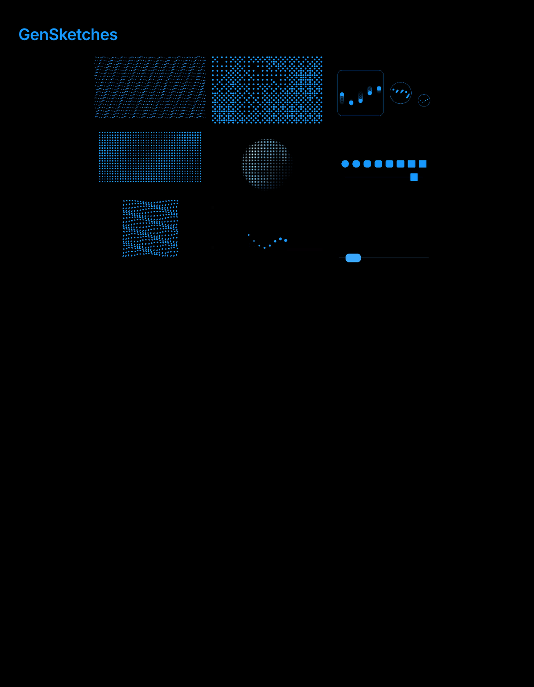

# GenSketches

Visual studies in p5.js + DOM exploring the **nuance and behavior of an Agent** for upcoming/future interfaces. Created for the Samsung January project.

Shared visual language: Samsung blue `#1697ff` on `#000`.



## Sketches

| # | Slug | Idea |
|---|---|---|
| 01 | `01-morphing-grid` (Breath) | Circular dots smoothly interpolate between random states — caring, breathing response. |
| 02 | `02-wave-squares` (Intent Wave) | Smoothed two-octave terrain driven by a directional wave — structured intent. |
| 03 | `03-wave-circles` (Watchful Hum) | Circular grid variant — ambient, watchful presence. |
| 05 | `05-clock-mask` (Quiet Drift) | Multi-octave noise + ordered dither dot field, top half only. |
| 06 | `06-living-orb` (Living Orb) | 2D dots simulating a lit 3D sphere — agent's essential self-form. |
| 08 | `08-breathing-chord` (Breathing Chord) | 8 voices breathing as a traveling wave, responsive to mic. |
| 09 | `09-breathing-chord-b` (Breathing Chord · Scales) | Same system at 380 / 180 / 100 sizes side by side, plus a pure-DOM mirror of the 100 — comparing scales. |
| 11 | `11-rect-of-circles` | Rounded-rect instances morphing circle → square left to right, with an echoing moving shape. |
| 12 | `12-rect-of-circles-b` | Variant — single moving shape expanding 1×→6× in width, blue→white, r value capped at 38% × max. |

## Features

- **Slider override via URL** — every `createSlider(min, max, default, step)` call accepts `?s1=…&s2=…` to set defaults from the URL.
- **`?hide=1`** — hides all on-page DOM controls (sliders, record button, nav arrows) for clean headless capture.
- **In-page canvas recorder** — a RECORD button bottom-left starts a 3-2-1 countdown, then records the canvas via `MediaRecorder` and downloads MP4 (Safari/recent Chrome) or WebM on stop.
- **Prev/Next slide navigation** — arrow buttons on the page edges + `←`/`→` keys cycle through sketches with a slide transition.
- **Inter Light captions** — small labels distinguish canvas (`p5.js`) from DOM-only (`html, css, js only (without canvas)`) implementations where both exist.
- **Mic + tone reactive** (sketches 08, 09) — `p5.AudioIn` + `p5.FFT` map loudness and spectral centroid into wave velocity, drift amplitude, and per-voice swell.

## Run locally

Each sketch is a standalone static page. From the repo root:

```bash
# Any static server works.
python3 -m http.server 4321
# or
npx serve .
```

Then open <http://localhost:4321> and pick a sketch from the landing page.

A local server is required for mic permission + module loads. Opening `index.html` directly in the browser will work for most sketches but not the mic-reactive ones.

## Structure

```
GenSketches/
├── index.html                  # landing page (3-col masonry of mp4 previews)
├── style.css                   # landing page styles
├── docs/
│   └── landing.png             # README screenshot
├── previews/                   # mp4 / gif thumbnails per sketch
├── scripts/
│   └── webm-to-mp4.sh          # convert browser-recorded webm to mp4
├── 01-morphing-grid/
├── 02-wave-squares/
├── 03-wave-circles/
├── 05-clock-mask/
├── 06-living-orb/
├── 08-breathing-chord/
├── 09-breathing-chord-b/
├── 11-rect-of-circles/
└── 12-rect-of-circles-b/
```

Each sketch folder contains its own `index.html`, `sketch.js`, `style.css`, and vendored `p5.js` / `p5.sound.min.js` (the HTML loads p5 from CDN; local copies preserved from the original p5 web editor export).

## Tech

- [p5.js](https://p5js.org/) 1.11.x + p5.sound (via CDN)
- Vanilla HTML/CSS for the landing page
- Inter (Google Fonts) for labels
- Headless Chrome + Python PIL for preview capture
